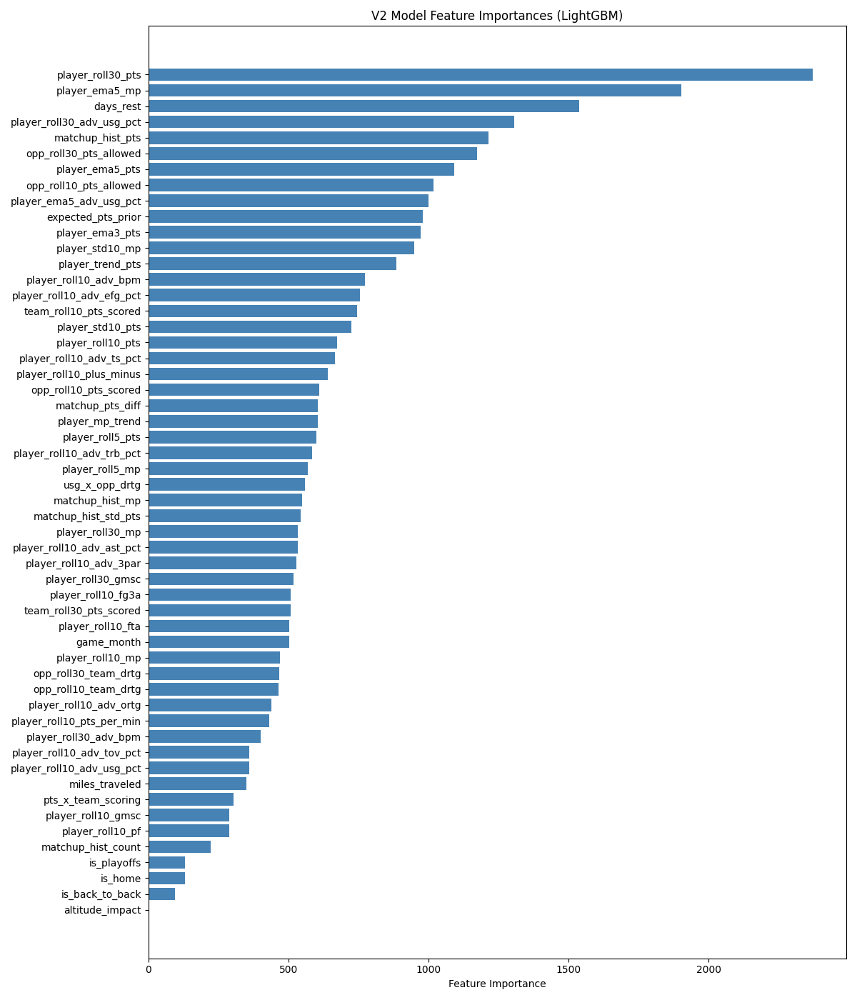
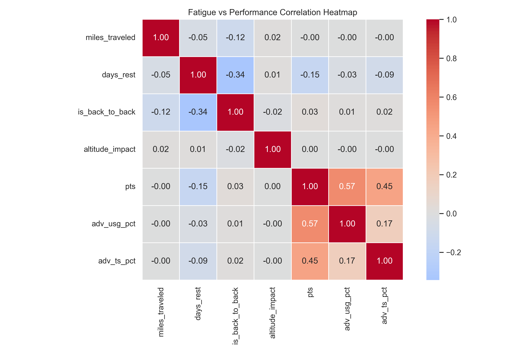
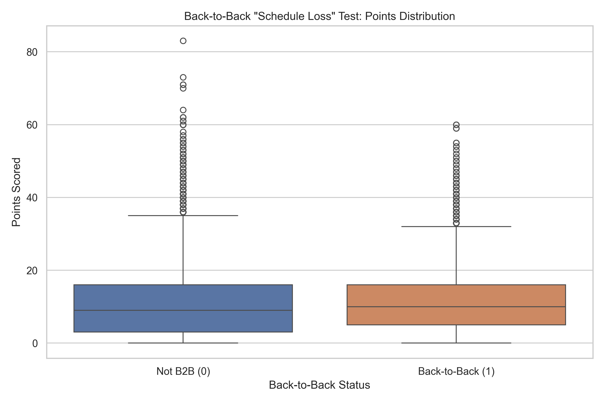
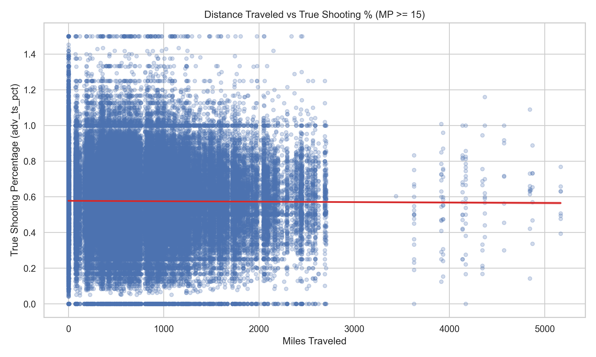
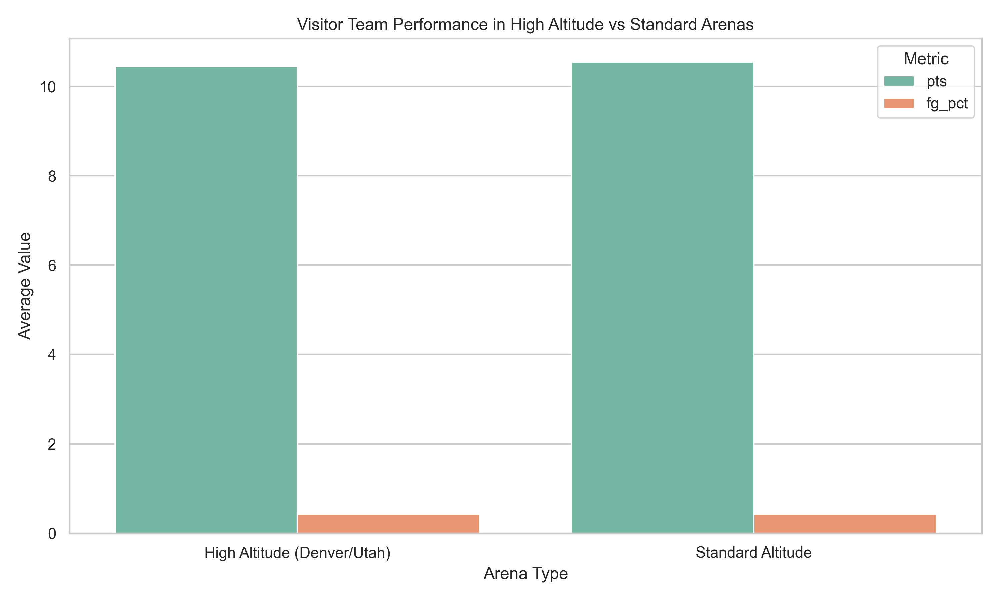

# Predicting NBA Player Game Scores with Contextual Modeling

**Data Management for Data Science — Final Project**
Matthew Specht and Ferit Bayrakdar

---

## Demo

> **[Video walkthrough — 8–10 minutes, coming soon]**

---

## Problem Definition

NBA player scoring is one of the most commonly predicted quantities in sports, however many models look only at simple metrics such as their recent performance. There are certainly more factors at play, many of which are hard to quantify, but this project is a solid attempt to model this end-to-end.

We built a full pipeline to predict NBA player points in a given game with confidence intervals. Our core differentiating factor is **travel fatigue**, calculated from real GPS coordinates and how many days of rest the player has had, as well as **per-matchup history** against each opponent. These factors are frequently overlooked by similar models.

The practical use case is player proposition bets, where the model's predicted distribution can be compared to a sportsbook line to identify mispriced outcomes.

The most realistic use case for this project is fantasy/player prop betting, so we chose to display our predictions using a distribution and slider as well so that a user could compare our prediction to sportsbook lines and identify higher value bets.

Previous work on NBA prediction (Loeffelholz et al., 2009; Thabtah et al., 2019) has only achieved R² values around ~0.5, which we figured we could improve upon if we took into account more different features. Our hypothesis iss that we can explain more of the variance in player performances by adding explicit fatigue and matchup context to our model.

---

## Course Concepts

| Class concept | Our implementation |
|:---|:---|
| **Web Scraping** | `schedule_scraper.py` and `game_scraper.py` pull schedules and box scores from Basketball-Reference using `requests` + `BeautifulSoup`, with time inbetween to avoid rate limiting |
| **Data Cleaning** | `preprocess.py` handles null rows, inconsistent column names across seasons, type coercion, and zero-minute filtering — no manual edits to raw files |
| **Relational Database Design** | Five 3NF-normalized SQLite tables with foreign key constraints; schema defined in `db_schema.sql`, follows all taught SQL etiquette from course |
| **Feature Engineering** | Haversine travel distance, rolling windows at three time horizons, EWM, per-opponent matchup aggregates — all computed in Python and stored in the DB |
| **Data Provenance** | Raw data is preserved unedited in `datasets/raw/`. Every transformation is script-driven and perfectly replicable. `refresh_state.json` tracks the last update timestamp for incremental refreshes |

---

## Data

All data is scraped from [Basketball-Reference](https://www.basketball-reference.com/): game schedules and per-player box scores (basic + advanced) for every NBA game played since January 1st, 2020, producing roughly 130,000 player-game records. Arena GPS coordinates for all 30 arenas were found using BatchGeo and compiled into `datasets/assets/arena_coords.csv` and used to compute travel distances at load time.

### Data Provenance

```
Basketball-Reference.com (HTML)
         │
         ▼
 schedule_scraper.py     →  datasets/raw/schedule.csv
         │
         ▼
  game_scraper.py        →  datasets/raw/player_stats_YYYY.csv  (one per season)
         │
         ▼
   preprocess.py         →  datasets/processed/performances.csv
         │
         ▼
    build_db.py          →  datasets/game_db.db
   (db_schema.sql)
         │
         ▼
      train.py           →  artifacts/mean_model.pkl
                             artifacts/q10_model.pkl / q90_model.pkl
                             artifacts/metrics.json
         │
         ▼
inference.py + api.py   →  HTTP predictions via web UI
```

Raw data is never overwritten since future refreshes only append, and `refresh_state.json` tracks what has already been collected so incremental refreshes exclusively fetch new games. Everything is done using scripts and perfectly replicable, though scraping from scratch will take several hours due to BBall-Ref's rate limits.

### Database Schema

Five normalized tables (3NF):

```
Arenas(arena_name PK, latitude, longitude)
Teams(team_acronym PK)
Players(player_id PK, player_name)
Games(game_id PK, game_date, home_team FK, visitor_team FK, arena_name FK)
Performances(performance_id PK, game_id FK, player_id FK, team_acronym FK,
             miles_traveled, days_rest, is_back_to_back, altitude_impact,
             [box score stats: pts, mp, fg, ast, reb, ...],
             [advanced stats: ts_pct, usg_pct, bpm, ortg, drtg, ...])
```

The four fatigue/context columns are computed at load time from arena coordinates and game dates, then stored directly in `Performances` so they are available at training and inference without re-joining.

### Features

| Data Type | Our Features |
|:---|:---|
| **Nominal** | `is_home`, `is_back_to_back`, `altitude_impact`, `is_playoffs`, `game_month` |
| **Ordinal** | `days_rest` — ordered integer capped at 10, so differences at the upper end are compressed and equal spacing cannot be assumed |
| **Interval** | `BPM` and rolling BPM; `+/-` and rolling `+/-`; momentum (ema5 − roll30 pts) |
| **Ratio** | Everything else: `miles_traveled`; all rolling pts/mp windows (L5, L10, L30); EWMAs of pts/mp/USG%; `USG%`, `TS%`, `eFG%`, `AST%`, `TOV%`, `TRB%`, `3PAr`, `GmSc`; `ORtg`, `DRtg`; matchup history mean/std/count; opp pts allowed L10/L30; team/opp PPG; pts/min; std dev of pts/mp |

**Total: 54 features**

---

## Methodology

### ETL

- **Scraping:** `schedule_scraper.py` iterates over all seasons and months to collect data and relative URLs for each game played. Then, `game_scraper.py` follows those URLs to extract per-player stats. Advanced stats on Basketball-Reference are embedded in HTML comments (not rendered tables), so the scraper uses a fallback parser. Both scripts implement 3.1-second delays to avoid rate limits, so scraping was an overnight process that took roughly 7 hours. Results were broken up into separate csv's for each year.
- **Preprocessing:** `preprocess.py` standardizes column names across seasons, filters DNP (0 minute) rows, and computes fatigue features sorted chronologically per player:
  - `miles_traveled`: Haversine great-circle distance from the player's previous arena
  - `days_rest`: Days since last game, capped at 10 (account for long breaks, injuries)
  - `is_back_to_back`: Flag when `days_rest == 1`
  - `altitude_impact`: Flag for Denver (5,280 ft) and Salt Lake City (4,330 ft)
- **Loading:** `build_db.py` inserts records in foreign-key dependency order in 5,000-row chunks. The process is idempotent: re-running it drops and recreates the database from the current processed CSV just to be safe, not a very long process with SQLite.

### Modeling

**Train/test split:** All games before the start of 2025 for training; all games after held out as the test set. No random shuffling since temporal ordering is required to prevent look-ahead bias.

**Leakage prevention:** All rolling features are grouped by player, sorted chronologically, and shifted by one game before computation. The target game's statistics never appear in any feature.

**LightGBM (primary):** Hyperparameters tuned with Optuna (50 trials, 3-minute budget). A temporal holdout (last 15% of training data) is used for early stopping.

**XGBoost (secondary):** Fixed hyperparameters, included for ensemble averaging.

**Ensemble:** Simple average of LightGBM and XGBoost. Marginally reduces RMSE.

**Quantile models:** Two additional LightGBM models trained with `objective='quantile'` at `alpha=0.10` and `alpha=0.90` produce calibrated 80% confidence intervals. Calibration is evaluated as empirical coverage on the test set.

**Matchup imputation:** For a player with no prior history against a given opponent, matchup features are filled from the player's own rolling baseline rather than a global mean (especially useful for newer players in the league).

---

## Results & Analysis

### Model Performance (2024–25 test set)

| Model | R² | MAE | RMSE |
|:---|:---:|:---:|:---:|
| LightGBM | 0.531 | 4.59 pts | 6.00 pts |
| XGBoost | 0.526 | 4.60 pts | 6.03 pts |
| Ensemble | 0.530 | 4.59 pts | 6.00 pts |

**80% Confidence Intervals:** empirical coverage = **79.0%** (target: 80%), average width = **14.4 pts**

An R² of ~0.53 is consistent with the published range for single-game NBA scoring prediction, and the near-perfect interval calibration confirms the quantile models are well-fitted. The 4.6-pt MAE reflects the fundamental randomness of individual games: foul trouble, shot variance, and injuries are impossible to predict off of box scores alone. We did our absolute best, trying to take into account advanced factors such as the trends in players' minutes, but could not push the R² any higher than this no matter how hard we tried. This just goes to show how truly random sports are, but our model is certainly very robust.

### Feature Importance



Rolling scoring windows (`roll10_pts`, `ema5_pts`) and usage rate dominate importance. Contextual features (`miles_traveled`, `is_back_to_back`, `days_rest`) rank in the middle tier, certainly influencing the outcome but being more minor factors. Matchup history features contribute most for veterans playing division rivals repeatedly. Our hypothesis that significant changes in altitude may affect performance turned out false, as there was no statisticaly significant impact.

### Feature Correlations



### Fatigue & Context Effects







---

## Discussion & Limitations

**What worked well:** The quantile calibration is strong (79% empirical on 80% nominal). The multi-horizon feature set (L5/L10/L30 windows + EWM) outperforms single-window models. Matchup imputation from per-player baselines handles cold-start better than falling back to a global mean. We also believe that our frontend UI is very easy to understand and use for betting evaluation.

**Single-game variance is high.** Individual game performances are incredibly random, leading to the relatively wide confidence intervals. Even with that precaution, there are anomalies. Famously, Bam Adebayo, who barely averaged 20 PPG this season, miraculously dropped an 83 point performance this year. This is something no model ever created could hope to predict.

**Limitations:** The model cannot take into account factors such as injuries, which we tried to remedy using minutes and usage rates, but it is not as good as being able to interpret/predict injury lists.
Our altitude prediction ended up completely irrelevant, but it was nice to know that it's not a meaningful factor after all.
Rate-limiting from our chosen source website means that scraping is incredibly slow, but since we only need to append onto our existing dataset, this is not a huge problem.
During the initial setup, we messed up by not accounting for international characters in player names, leading to anomalies such as Nikola Jokić being stored as Nikola JokiÄ. This was realized too late, and is a still existing issue in the code.

**Future directions:** We would like to somehow add lineup/injury data and automate weekly retraining as new games accumulate. Additionally, perhaps using something like the Kalshi API, we could add the ability to compare model predictions against opening sportsbook lines to find the largest discrepancies and recommend certain bets.

---

## Reproducibility

### Setup

```bash
git clone https://github.com/matspe24/NBA-Contextual-Modeling.git
cd NBA-Contextual-Modeling
python -m venv venv
source venv/bin/activate
pip install -r requirements.txt
```

### Full Pipeline

```bash
python nba/etl/schedule_scraper.py      # scrape schedules → datasets/raw/schedule.csv
python nba/etl/game_scraper.py          # scrape box scores → datasets/raw/player_stats_YYYY.csv
python nba/etl/preprocess.py            # clean + feature compute → datasets/processed/performances.csv
python nba/etl/build_db.py             # load SQLite → datasets/game_db.db
python nba/modeling/train.py            # train models → artifacts/
python nba/modeling/charts.py           # generate plots → plots/
```

Steps 1–2 involve network requests to Basketball-Reference and take several hours due to rate limiting.

### Run the Web UI

```bash
cd nba/server
uvicorn api:app --host 0.0.0.0 --port 8000
# open http://localhost:8000
```

### CLI Prediction

```bash
python nba/modeling/inference.py --player "LeBron James" --opp LAC --line 24.5 --is_home 1
```

### Incremental Refresh

```bash
python nba/etl/refresh.py    # fetches only games since last update
```

---

## Directory Structure

```
NBA-Contextual-Modeling/
├── datasets/
│   ├── raw/                      # Original scraped CSVs (append-only)
│   ├── processed/                # Cleaned, typed dataset
│   ├── assets/                   # arena_coords.csv, player/team image URLs
│   ├── game_db.db                # SQLite database
│   └── refresh_state.json        # Last update timestamp
├── artifacts/                    # Trained model weights + metrics.json
├── plots/                        # Generated visualizations
├── nba/
│   ├── etl/                      # schedule_scraper, game_scraper, preprocess, build_db, refresh
│   ├── modeling/                 # train, inference, charts, evaluate
│   └── server/                   # FastAPI api.py + static/ (index.html, script.js, style.css)
└── requirements.txt
```

---

## References

Loeffelholz, B., Bednar, E., & Bauer, K. W. (2009). Predicting NBA games using neural networks. *Journal of Quantitative Analysis in Sports*, 5(1).

Thabtah, F., Zhang, L., & Abdelhamid, N. (2019). NBA game result prediction using feature analysis and supervised learning. *Applied Computing and Informatics*, 15(2), 58–66.
